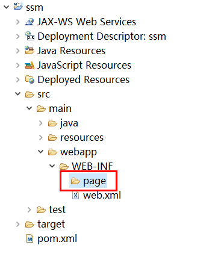
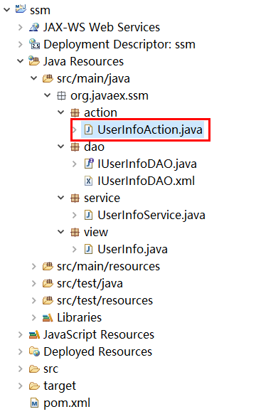

## 基础知识

### SSM 框架概述

#### 简介

SSM（Spring+SpringMVC+MyBatis）框架集由Spring、SpringMVC、MyBatis 三个开源框架整合而成，常作为数据源较简单的 web 项目的框架。

#### Spring

一个轻量级的控制反转（IOC）和面向切面（AOP）的容器框架

#### SpringMVC

分离了控制器、模型对象、分派器以及处理程序对象的角色，这种分离让它们更容易进行定制

#### MyBatis

一个支持普通SQL查询，存储过程和高级映射的优秀持久层框架

#### MVC设计思想

表现层：html + css + jquery + ajax
控制层：springmvc
业务层：service组件
持久层：dao组件

## 项目搭建

### 创建Maven工程

#### 新建项目


#### 选择Maven工程


#### 勾选创建一个简单的工程


#### 填写必要的内容

关于　Group Id 和 Artifact Id 到底应该填什么，众说纷纭
比较靠谱的说法是：Group Id 和 Artifact Id 被统称为“坐标”，是为了保证项目唯一性而提出的，如果你要把你项目弄到maven本地仓库去，你想要找到你的项目就必须根据这两个id去查找
一般来讲，我们在 Group Id 栏填写域名的反写，Artifact Id 栏填写项目名
我们要部署并运行项目，所以Packaging（打包方式）这边选择war包


#### 解决报错问题（生成web.xml文件）


#### 指定tomcat运行


## 导入 jar 包

### springMVC

#### 导包方式

导包方式有2种：一种是eclipse直接选择或下载jar包，自动生成xml配置
另一种是复制粘贴xml配置，自动下载jar包

我们这边选择第一种，手动选择jar包，让它自动生成xml配置

#### jar版本

jar版本根据实际需求酌情选择，这里只做演示用

#### 选择导包界面


#### spring-webmvc

点击Add按钮，弹出窗口中搜索 spring-webmvc，选择图例中的jar包 


这里以版本 3.2.8 为例 


选择后，jar包就被添加进来了


切换到 pom.xml 选项卡，可以发现，jar包对应的xml配置已经自动生成了


#### 保存配置

选择jar包后，一定要按 Ctrl + S 对 pom.xml 文件进行保存

然后 Maven 下就会自动添加jar包进去 


### Spring

Spring-jdbc，用于事务控制


### mybatis


### 连接池

#### 连接池的作用

访问量过大时，连接池可以限制连接数量，保护服务器数据
在第一并发量时，连接池可以重用数据库连接，提高访问的效率

#### commons-dbcp


### 数据库驱动

#### SQLServer

sql Server连接JDBC需要以下jar包的支持：

* msbase.jar
* mssqlserver.jar
* msutil.jar
* sqljdbc4.jar

#### sqljdbc4


### mybatis-spring

该插件用于整合spring和mybatis


### jstl


### jackson

用于返回json数据


保存之后，我们可以发现，引入的这个 jackson 报错了，切换到 pom.xml 选项卡


删除红框标记的那一行即可


## 构建基本目录

### 包目录

根据mvc分层思想，创建包目录


#### action

action表示控制层，用于接收请求，并返回数据或转发页面

绝大多数人喜欢把包名取为controller，我这里取名为action是因为：我个人觉得SSM框架对新手很不友好，配置一大堆，报错牛头不对马嘴。没有概念的新手甚至搞不清每一层到底是干什么的，应该从哪一层开始写代码。鉴于很多导演喜欢装假洋鬼子，action、action地叫，所以，这边把包名取名为action，用户发送请求直接去action包下就是了。

#### service

service表示业务逻辑层，用于处理事务

action接收请求后，会调用service层的函数做事务处理，代码逻辑的实现就写在service层

#### dao

dao表示持久层，用来写sql

service层需要用到数据库数据时，会调用dao层的sql接口

#### view

view包下写实体类，就是有 set/get 函数的类。封装dao层取出来的数据为一个对象

### 后台页面目录

在src\main\webapp\WEB-INF下创建一个目录

该目录的名字随意取，该目录下存放页面文件
WEB-INF目录是不可见的，所以其下的文件是安全的
一般来讲存放的是需要登录后才可以访问的后台管理页面



### 静态资源目录

在src\main\webapp下创建一个目录

该目录的名字随意取，该目录下存放前端样式文件


### 默认首页

在src\main\webapp下创建一个 index.jsp 文件


## 配置文件

### 数据库

在src\main\resources目录下创建数据库连接配置文件 db.properties


#### 填写配置内容

oracle、mysql、sql server，3者的写法均不同

变量名可以随意取，但是要注意，不能和系统内置的变量名起冲突

等号右边的内容，不要加双引号或单引号

#### SQLServer的配置

```
driver = com.microsoft.sqlserver.jdbc.SQLServerDriver
url = jdbc:sqlserver://数据库地址（一般写ip地址）;DatabaseName=数据库名称
username = 数据库用户名
password = 数据库密码
```


### spring-mybatis

在src\main\resources目录下创建spring-mybatis整合配置文件 spring-mybatis.xml


文字不好描述，直接看图吧


懒人请直接复制代码

```xml
<?xml version="1.0" encoding="UTF-8"?>
<beans xmlns="http://www.springframework.org/schema/beans" xmlns:xsi="http://www.w3.org/2001/XMLSchema-instance"
	xmlns:context="http://www.springframework.org/schema/context" xmlns:util="http://www.springframework.org/schema/util"
	xmlns:jee="http://www.springframework.org/schema/jee" xmlns:tx="http://www.springframework.org/schema/tx"
	xmlns:jpa="http://www.springframework.org/schema/data/jpa" xmlns:mvc="http://www.springframework.org/schema/mvc"
	xsi:schemaLocation="
		http://www.springframework.org/schema/beans http://www.springframework.org/schema/beans/spring-beans-3.2.xsd
		http://www.springframework.org/schema/context http://www.springframework.org/schema/context/spring-context-3.2.xsd
		http://www.springframework.org/schema/util http://www.springframework.org/schema/util/spring-util-3.2.xsd
		http://www.springframework.org/schema/jee http://www.springframework.org/schema/jee/spring-jee-3.2.xsd
		http://www.springframework.org/schema/tx http://www.springframework.org/schema/tx/spring-tx-3.2.xsd
		http://www.springframework.org/schema/data/jpa http://www.springframework.org/schema/data/jpa/spring-jpa-1.3.xsd
		http://www.springframework.org/schema/mvc http://www.springframework.org/schema/mvc/spring-mvc-3.2.xsd">
	
	<util:properties id="config" location="classpath:db.properties"></util:properties>
	<!-- 配置数据库连接参数及连接池 -->
	<bean id="ds" class="org.apache.commons.dbcp.BasicDataSource" destroy-method="close">
		<property name="driverClassName" value="#{config.driver}" />
		<property name="url" value="#{config.url}" />
		<property name="username" value="#{config.username}" />
		<property name="password" value="#{config.password}" />
	</bean>
	
	<!-- spring集成mybatis，不再需要mybatis的配置文件 -->
	<!-- 配置SqlSessionFactoryBean -->
	<bean id="ssfb" class="org.mybatis.spring.SqlSessionFactoryBean">
		<!-- 注入连接池 -->
		<property name="dataSource" ref="ds"></property>
		<!-- 映射文件的位置 -->
		<property name="mapperLocations" value="classpath:org/javaex/ssm/dao/*.xml"></property>
	</bean>
	
	<!-- 该bean负责调用SqlSession的getMapper函数 -->
	<bean class="org.mybatis.spring.mapper.MapperScannerConfigurer">
		<property name="basePackage" value="org.javaex.ssm.dao" />
	</bean>
	
	<!-- 开启事务注解驱动 -->
	<tx:annotation-driven />
	<!-- (事务管理) -->
	<bean id="transactionManager" class="org.springframework.jdbc.datasource.DataSourceTransactionManager">
		<property name="dataSource" ref="ds" />
	</bean>
</beans>
```

### spring-mvc

在src\main\resources目录下创建spring-mvc整合配置文件 spring-mvc.xml


文字不好描述，直接看图吧


懒人请直接复制代码

```xml
<?xml version="1.0" encoding="UTF-8"?>
<beans xmlns="http://www.springframework.org/schema/beans" xmlns:xsi="http://www.w3.org/2001/XMLSchema-instance"
	xmlns:context="http://www.springframework.org/schema/context" xmlns:util="http://www.springframework.org/schema/util"
	xmlns:jee="http://www.springframework.org/schema/jee" xmlns:tx="http://www.springframework.org/schema/tx"
	xmlns:jpa="http://www.springframework.org/schema/data/jpa" xmlns:mvc="http://www.springframework.org/schema/mvc"
	xsi:schemaLocation="
		http://www.springframework.org/schema/beans http://www.springframework.org/schema/beans/spring-beans-3.2.xsd
		http://www.springframework.org/schema/context http://www.springframework.org/schema/context/spring-context-3.2.xsd
		http://www.springframework.org/schema/util http://www.springframework.org/schema/util/spring-util-3.2.xsd
		http://www.springframework.org/schema/jee http://www.springframework.org/schema/jee/spring-jee-3.2.xsd
		http://www.springframework.org/schema/tx http://www.springframework.org/schema/tx/spring-tx-3.2.xsd
		http://www.springframework.org/schema/data/jpa http://www.springframework.org/schema/data/jpa/spring-jpa-1.3.xsd
		http://www.springframework.org/schema/mvc http://www.springframework.org/schema/mvc/spring-mvc-3.2.xsd">
	
	<!-- 开始组件扫描 -->
	<context:component-scan base-package="org.javaex.ssm"></context:component-scan>
	
	<!-- 启用注解驱动 -->
	<mvc:annotation-driven></mvc:annotation-driven>
	
	<!-- 处理静态资源 -->
	<mvc:default-servlet-handler/>
	
	<!-- 配置视图解析器 -->
	<bean class="org.springframework.web.servlet.view.InternalResourceViewResolver">
		<property name="prefix" value="/WEB-INF/page/"></property>
		<property name="suffix" value=".jsp"></property>
	</bean>

</beans>
```

### web.xml

找到src\main\webapp\WEB-INF目录下的web.xml


文字不好描述，直接看图吧


懒人请直接复制代码

```xml
<?xml version="1.0" encoding="UTF-8"?>
<web-app xmlns:xsi="http://www.w3.org/2001/XMLSchema-instance" xmlns="http://java.sun.com/xml/ns/javaee" xsi:schemaLocation="http://java.sun.com/xml/ns/javaee http://java.sun.com/xml/ns/javaee/web-app_2_5.xsd" version="2.5">
	<display-name>ssm</display-name>
	<welcome-file-list>
		<welcome-file>index.html</welcome-file>
		<welcome-file>index.htm</welcome-file>
		<welcome-file>index.jsp</welcome-file>
		<welcome-file>default.html</welcome-file>
		<welcome-file>default.htm</welcome-file>
		<welcome-file>default.jsp</welcome-file>
	</welcome-file-list>
	
	<!-- 配置静态资源文件路径 -->
	<servlet-mapping>
		<servlet-name>default</servlet-name>
		<url-pattern>/static/*</url-pattern>
	</servlet-mapping>
	
	<!-- spring mvc 请求响应 -->
	<servlet>
		<servlet-name>SpringMVC</servlet-name>
		<servlet-class>
			org.springframework.web.servlet.DispatcherServlet
		</servlet-class>
		<init-param>
			<param-name>contextConfigLocation</param-name>
			<param-value>classpath:spring-*.xml</param-value>
		</init-param>
	</servlet>
	<servlet-mapping>
		<servlet-name>SpringMVC</servlet-name>
		<url-pattern>*.action</url-pattern>
	</servlet-mapping>
	<servlet-mapping>
		<servlet-name>SpringMVC</servlet-name>
		<url-pattern>*.json</url-pattern>
	</servlet-mapping>

</web-app>
```

## 访问测试

### 准备数据库数据

创建 user_info 表，并添加一条数据


### 实体类

创建 UserInfo 实体类

```java
package org.javaex.ssm.view;

public class UserInfo {
	private String id;	// 主键
	private String loginName;	// 登录名
	private String passWord;	// 登录密码

	public String getId() {
		return id;
	}
	public void setId(String id) {
		this.id = id;
	}
	public String getLoginName() {
		return loginName;
	}
	public void setLoginName(String loginName) {
		this.loginName = loginName;
	}
	public String getPassWord() {
		return passWord;
	}
	public void setPassWord(String passWord) {
		this.passWord = passWord;
	}
}
```

### dao层

创建接口类和xml文件


IUserInfoDAO.java

写接口函数，如果有2个以上的参数，则必须给参数加@Param参数注解

```java
package org.javaex.ssm.dao;

import org.apache.ibatis.annotations.Param;
import org.javaex.ssm.view.UserInfo;

public interface IUserInfoDAO {

	/**
	 * 校验用户
	 * @param loginName 登录名
	 * @param passWord 登录密码
	 * @return
	 */
	UserInfo checkUser(@Param("loginName") String loginName, @Param("passWord") String passWord);

}
```

IUserInfoDAO.xml

用来写sql文，实现dao层接口。sql的id对应接口的函数名

```xml
<?xml version="1.0" encoding="UTF-8" ?>
<!DOCTYPE mapper PUBLIC "-//ibatis.apache.org//DTD Mapper 3.0//EN"
 "http://ibatis.apache.org/dtd/ibatis-3-mapper.dtd">

<mapper namespace="org.javaex.ssm.dao.IUserInfoDAO">
	
	<!-- 建立sql查询结果字段与实体属性的映射关系 -->
	<resultMap id="UserInfoMap" type="org.javaex.ssm.view.UserInfo">
		<result column="id" property="id" />
		<result column="login_name" property="loginName" />
		<result column="pass_word" property="passWord" />
	</resultMap>
	
	<!-- 校验用户 -->
	<select id="checkUser" resultMap="UserInfoMap">
		SELECT
			*
		FROM
			user_info
		WHERE
			1 = 1
		<if test="loginName != null and loginName != ''">AND login_name=#{loginName}</if>
		<if test="passWord != null and passWord != ''">AND pass_word=#{passWord}</if>
	</select>
</mapper>
```

### service层

创建一个java文件，处理事务


UserInfoService.java

```java
package org.javaex.ssm.service;

import org.javaex.ssm.dao.IUserInfoDAO;
import org.javaex.ssm.view.UserInfo;
import org.springframework.beans.factory.annotation.Autowired;
import org.springframework.stereotype.Service;

@Service("UserInfoService")
public class UserInfoService {
	@Autowired
	private IUserInfoDAO iUserInfoDAO;

	/**
	 * 校验用户登录
	 * @param loginName 登录名
	 * @param passWord 登录密码
	 * @return
	 */
	public UserInfo checkUser(String loginName, String passWord) {
		
		return iUserInfoDAO.checkUser(loginName, passWord);
	}
}
```

### 准备页面

我们需要一个默认首页，这个之前已经创建过了。还需要一个登陆页面，一个主页


index.jsp（默认首页）

这个页面啥也不干，直接发送请求到后台，并跳转到登录页

```xml
<%
	pageContext.setAttribute("APP_PATH", request.getContextPath());
%>
<script>
	window.location.href = "${APP_PATH}/user_info/index.action";
</script>
```

login.jsp（登录页）

```html
<%@ page pageEncoding="utf-8"%>
<!doctype html>
<html>
<head>
<meta charset="utf-8">
<title>登录页</title>
</head>

<body>
	<form id="loginForm" action="login.action" method="post">
		登录名:<input type="text" name="login_name" />
		密码:<input type="password" name="pass_word" />
		<input type="submit" value="登录" />
	</form>
</body>
</html>
```

home.jsp（主页）

登录成功后，会跳转到此页

```html
<%@ page pageEncoding="utf-8"%>
主页
```

### 控制层

创建一个java文件，用于接收请求



UserInfoAction.java

```java
package org.javaex.ssm.action;

import org.javaex.ssm.service.UserInfoService;
import org.javaex.ssm.view.UserInfo;
import org.springframework.beans.factory.annotation.Autowired;
import org.springframework.stereotype.Controller;
import org.springframework.ui.ModelMap;
import org.springframework.util.StringUtils;
import org.springframework.web.bind.annotation.RequestMapping;
import org.springframework.web.bind.annotation.RequestParam;

@Controller
@RequestMapping("user_info")
public class UserInfoAction {

	@Autowired
	private UserInfoService userInfoService;
	
	/**
	 * 首页跳转登录页面
	 */
	@RequestMapping("index.action")
	public String index() {
		return "login";
	}
	
	/**
	 * 用户登录
	 * @param loginName 登录名
	 * @param passWord 登录密码
	 */
	@RequestMapping("login.action")
	public String login(ModelMap map,
			@RequestParam(required = false, value = "login_name") String loginName,
			@RequestParam(required = false, value = "pass_word") String passWord) {
		
		// 如果登录名或密码未填写，直接返回登录页面
		if (StringUtils.isEmpty(loginName) || StringUtils.isEmpty(passWord)) {
			return "login";
		}
		
		// 校验用户名、密码是否正确
		UserInfo userInfo = userInfoService.checkUser(loginName, passWord);
		if (userInfo==null) {
			return "login";
		}
		
		// 登录成功，进入主页
		return "home";
	}
}
```

### 访问

访问地址：http://localhost:8080/ssm

进入默认首页index.jsp，并直接向后台发送请求，并转发到登录页


登录成功后，进入主页

