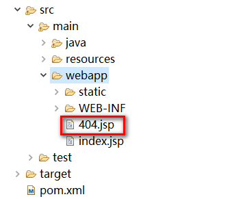

## ajax & jstl

### ajax

基本用法

```js
$.ajax({
	url : "${pageContext.request.contextPath}/save.json",
	type : "POST",
	dataType : "json",
	data : {
		"id" : id,
		"name" : name
	},
	success : function(rtn) {

	},
	error : function(rtn) {

	}
});
```

序列化提交（模仿form表单，将name的元素全都提交）

```js
$.ajax({
	url : "save.json",
	type : "POST",
	dataType : "json",
	data : $("#form").serialize(),
	success : function(rtn) {

	},
	error : function(rtn) {

	}
});
```

开启数组提交的支持

```js
traditional : "true",
```

开启同步请求的支持

```js
async : "false",
```

### jstl标签

jstl标签支持

```jsp
<%@ page language="java" contentType="text/html; charset=UTF-8" pageEncoding="UTF-8"%>
<%@taglib uri="http://java.sun.com/jsp/jstl/core" prefix="c"%>
<%@taglib uri="http://java.sun.com/jsp/jstl/functions" prefix="fn"%>
```

嵌套页面

```jsp
<c:import url="head.jsp"></c:import>
```

转发

```jsp
<jsp:forward page="portal/index.action"></jsp:forward>
```

if

```jsp
<c:if test="${userInfo.type=='admin'}">
	// 执行
</c:if>
```

if-else

```jsp
<c:choose>
	<c:when test="${fn:length(list)==0}">
		// 执行
	</c:when>
	<c:otherwise>
		// 执行
	</c:otherwise>
</c:choose>
```

if-else if-else

```jsp
<c:choose>
	<c:when test="${userInfo.type=='admin'}">
		// 执行
	</c:when>
	<c:when test="${userInfo.type=='teacher'}">
		// 执行
	</c:when>
	<c:otherwise>
		// 执行
	</c:otherwise>
</c:choose>
```

遍历循环

```jsp
<c:forEach items="${pageInfo.list}" var="entity" varStatus="status" >
	<tr>
		<td>${status.index+1}</td>
		<td>${entity.userName}</td>
		<td>${entity.userCode}</td>
	</tr>
</c:forEach>
```

## 乱码

### get请求乱码解决

修改tomcat下的conf/server.xml文件
找到如下代码：

```xml
<Connector connectionTimeout="20000" port="8080" protocol="HTTP/1.1" redirectPort="8443"/>
```

可以在这里添加一个属性：URIEncoding，将该属性值设置为UTF-8，即可让Tomcat（默认ISO-8859-1编码）以UTF-8的编码处理get请求

```xml
<Connector URIEncoding="utf-8" connectionTimeout="20000" port="8080" protocol="HTTP/1.1" redirectPort="8443"/>
```

### post请求乱码解决

在web.xml文件中添加以下代码

```xml
<!-- 字符过滤，防止post请求乱码 -->
<filter>
	<filter-name>SpringCharacterEncodingFilter</filter-name>
	<filter-class>org.springframework.web.filter.CharacterEncodingFilter</filter-class>
	<init-param>
		<param-name>encoding</param-name>
		<param-value>UTF-8</param-value>
	</init-param>
</filter>
<filter-mapping>
	<filter-name>SpringCharacterEncodingFilter</filter-name>
	<url-pattern>/*</url-pattern>
</filter-mapping>
```

## 数据

### 统一返回数据

采用链式操作返回信息，返回数据时，不再需要指定数据的类型

```java
/**
 * 返回统一json数据格式
 */
public class Result {

	// 状态码 000000：成功；999999：失败
	private String code;
	// 错误信息
	private String message;
	// 返回的数据（链式）
	private Map<String, Object> data = new HashMap<String, Object>();
	
	public static Result success() {
		Result result = new Result();
		result.setCode("000000");
		result.setMessage("操作成功");
		return result;
	}
	
	public static Result error(String msg) {
		Result result = new Result();
		result.setCode("999999");
		if (StringUtils.isEmpty(msg)) {
			result.setMessage("操作失败");
		} else {
			result.setMessage(msg);
		}
		return result;
	}
	
	// 链式操作返回信息
	public Result add(String key, Object value) {
		this.getData().put(key, value);
		return this;
	}
	
	public String getCode() {
		return code;
	}
	public void setCode(String code) {
		this.code = code;
	}
	public String getMessage() {
		return message;
	}
	public void setMessage(String message) {
		this.message = message;
	}
	public Map<String, Object> getData() {
		return data;
	}
	public void setData(Map<String, Object> data) {
		this.data = data;
	}
}
```

如该请求所示

```java
/**
 * 返回json数据
 */
@RequestMapping("get_data.json")
@ResponseBody
public Result getData(ModelMap map) {
	
	List<UserInfo> list = userInfoService.list();

	// 请求异常
	return Result.error("我是错误提示");
	// 请求成功
	return Result.success();
	// 请求成功并返回数据
	return Result.success().add("list", list);
}
```

### mybatis

LIKE 模糊查询

```xml
LIKE CONCAT('%', #{keyWord}, '%')
```

SELECT

```xml
<select id="list" resultMap="UserInfoMap">
	// sql语句
	// 如果返回int、String、hashmap等，需要将resultMap改成：resultType="int"等
</select>
```

INSERT

```xml
<insert id="insert">
	INSERT INTO type_info
	<trim prefix="(" suffix=")" suffixOverrides=",">
		<if test="sort!=null and sort!=''">sort,</if>
		<if test="name!=null and name!=''">name,</if>
	</trim>
	<trim prefix="values (" suffix=")" suffixOverrides=",">
		<if test="sort!=null and sort!=''">#{sort},</if>
		<if test="name!=null and name!=''">#{name},</if>
	</trim>
</insert>
```

UPDATE

```xml
<update id="update">
	UPDATE type_info
	<set>
		<if test="sort!=null">sort=#{sort},</if>
		<if test="name!=null">name=#{name},</if>
	</set>
	WHERE id = #{id}
</update>
```

DELETE

```xml
<delete id="delete">
	DELETE FROM user_info WHERE id = #{id}
</delete>
```

数组、list 循环：需要注意，其中的 idArr 指的是接口中的参数注解，如果没写注解，则数组写 array，lis t写 list

```xml
<delete id="delete">
	DELETE FROM user_info WHERE id IN
	<foreach collection="idArr" index="index" item="item" open="(" separator="," close=")">
		#{item}
	</foreach>
</delete>
```

子查询（单参数）

```xml
<collection property="type" ofType="ssm.view.TypeInfo"
	column="id" javaType="ssm.view.TypeInfo"
	select="ssm.dao.type_info.ITypeInfoDAO.queryById">
</collection>
```

子查询（多参数）

```xml
<collection property="teacherList" ofType="ssm.view.record"
	column="{activityId=activity_id, postCode=post_code}" javaType="list"
	select="ssm.dao.post_selection_record.IPostSelectionRecordDAO.queryTeacherList">
</collection>
```

得到刚刚insert到数据表中的记录的主键值

```xml
<insert id="insert">
	INSERT INTO user_info
	<trim prefix="(" suffix=")" suffixOverrides=",">
		<if test="loginName!=null and loginName!=''">login_name,</if>
		<if test="passWord!=null and passWord!=''">pass_word,</if>
		<if test="userType!=null and userType!=''">user_type,</if>
		<if test="status!=null and status!=''">status,</if>
	</trim>
	<trim prefix="values (" suffix=")" suffixOverrides=",">
		<if test="loginName!=null and loginName!=''">#{loginName},</if>
		<if test="passWord!=null and passWord!=''">#{passWord},</if>
		<if test="userType!=null and userType!=''">#{userType},</if>
		<if test="status!=null and status!=''">#{status},</if>
	</trim>
	<selectKey keyProperty="id" order="AFTER" resultType="String">
		<!-- 得到刚insert到数据表中的记录的主键值，只适用于自增主键 -->
		SELECT IDENT_CURRENT('user_info') AS id
	</selectKey>
</insert>
```


批量插入

```java
int count = 0;
int batchCount = 50;
List<EvaluationResultScore> evaluationResultScoreList = new ArrayList<EvaluationResultScore>();

for (int i=0; i<length; i++) {
	EvaluationResultScore evaluationResultScore = new EvaluationResultScore();
	evaluationResultScore.setResultId(resultId);
	evaluationResultScore.setItemId(itemId);
	evaluationResultScore.setOptionName(optionName);
	evaluationResultScore.setOptionScore(optionScore);
	evaluationResultScore.setRealScore(realScore);
	
	evaluationResultScoreList.add(evaluationResultScore);
	count++;

	if ((count%batchCount)==0) {
		iEvaluationResultScoreDAO.insertBatch(evaluationResultScoreList);
		evaluationResultScoreList.clear();
	}
}

if (evaluationResultScoreList!=null && evaluationResultScoreList.size()>0) {
	iEvaluationResultScoreDAO.insertBatch(evaluationResultScoreList);
	evaluationResultScoreList.clear();
}
```

sql文写法

```xml
<insert id="insertBatch">
	INSERT INTO evaluation_result_score (result_id, item_id, option_name, option_score, real_score)
	VALUES
	<foreach collection="list" item="item" index="index" separator=",">
		(#{item.resultId}, #{item.itemId}, #{item.optionName}, #{item.optionScore}, #{item.realScore})
	</foreach>
</insert>
```

sql server 2005兼容写法

```xml
<insert id="insertBatch">
	insert into evaluation_result_score
	(result_id, item_id, option_name, option_score, real_score)
	<foreach collection="list" item="item" index="index" separator="union all">
		select
			#{item.resultId}, #{item.itemId}, #{item.optionName}, #{item.optionScore}, #{item.realScore}
	</foreach>
</insert>
```

## 拦截器

定义拦截器（可以多个）

新建一个包，包名建议为：interceptor。在该包下新建2个类，名字建议为：自己的名字+Interceptor


拦截器需要实现HandlerInterceptor接口，并覆写接口中提供的三个方法

```java
/**
 * 拦截器
 */
public class QingInterceptor implements HandlerInterceptor {

	/**
	 * 执行Handler方法之前执行
	 * 用于身份认证、身份授权
	 */
	public boolean preHandle(HttpServletRequest request, HttpServletResponse response, Object handler)
			throws Exception {
		
		// 获取请求的url
		String szURI = request.getRequestURI();
		// 如果是登录，就放行
		if (szURI.indexOf("login")>=0) {
			return true;
		}
		
		// 判断session
		HttpSession session  = request.getSession();
		// 从session中取出用户身份信息
		UserInfo userInfo = (UserInfo)session.getAttribute("userInfo");
		// session存在时，放行
		if (userInfo!=null) {
			return true;
		}
		
		// 执行这里表示用户身份需要认证，跳转登陆页面
		request.getRequestDispatcher("/WEB-INF/page/admin/login.jsp").forward(request, response);
		
		return false;
	}

	/**
	 * 进入Handler方法之后，返回modelAndView之前执行
	 * 应用场景从modelAndView出发：将公用的模型数据(比如菜单导航)在这里
	 * 传到视图，也可以在这里统一指定视图
	 */
	public void postHandle(HttpServletRequest request, HttpServletResponse response, Object handler,
			ModelAndView modelAndView) throws Exception {
		
	}

	/**
	 * 执行Handler完成后，执行此方法
	 * 应用场景：统一异常处理，统一日志处理
	 */
	public void afterCompletion(HttpServletRequest request, HttpServletResponse response, Object handler, Exception ex)
			throws Exception {
		
	}

}
```

找到之前配置的spring-mvc.xml文件，并添加下列代码（修改拦截器类路径）

```xml
<!--拦截器 -->
<mvc:interceptors>
	<!--多个拦截器,顺序执行 -->
	<!-- 登陆认证拦截器 -->
	<mvc:interceptor>
		<mvc:mapping path="/**"/>
		<bean class="cn.javaex.ssm.interceptor.QingInterceptor"></bean>
	</mvc:interceptor>
</mvc:interceptors>
```

## 全局异常处理器

### 自定义异常类

新建一个包，包名建议为：exception

在该包下新建2个类，名字建议为：自己的名字+Exception 和 自己的名字+ExceptionResolver


QingException.java

```java
/**
 * 自定义异常类
 * 抛出预期异常信息
 */
public class QingException extends Exception {

	private static final long serialVersionUID = 1L;
	
	// 异常信息
	public String message;
	
	public QingException(String message){
		super(message);
		this.message = message;
	}

	public String getMessage() {
		return message;
	}

	public void setMessage(String message) {
		this.message = message;
	}	
}
```

### 全局异常处理器

QingExceptionResolver.java

```java
import java.io.IOException;
import java.util.HashMap;
import java.util.Map;

import javax.servlet.http.HttpServletRequest;
import javax.servlet.http.HttpServletResponse;

import org.springframework.web.bind.annotation.ResponseBody;
import org.springframework.web.method.HandlerMethod;
import org.springframework.web.servlet.HandlerExceptionResolver;
import org.springframework.web.servlet.ModelAndView;

import com.google.gson.Gson;

/**
 * 全局异常处理器
 */
public class QingExceptionResolver implements HandlerExceptionResolver {

	public ModelAndView resolveException(HttpServletRequest request,
			HttpServletResponse response, Object handler, Exception e) {
	
		// 向控制台打印错误信息
		e.printStackTrace();
		
		// 定义错误信息
		String message = "系统异常，请稍后重试";
		// 判断是不是自己抛出的错误
		if (e instanceof QingException) {
			message = ((QingException)e).getMessage();
		}
		
		// 判断是json请求还是页面转发请求
		HandlerMethod handMethod = (HandlerMethod)handler;
		ResponseBody responseBody = handMethod.getMethod().getAnnotation(ResponseBody.class);
		if (responseBody!=null) {
			// json请求（返回json数据）
			Map<String, Object> responseMap = new HashMap<String, Object>();
			responseMap.put("code", "999999");
			responseMap.put("message", message);
			String json = new Gson().toJson(responseMap);
			response.setCharacterEncoding("UTF-8");
			response.setContentType("application/json; charset=utf-8");
			try {
				response.getWriter().write(json);
				response.getWriter().flush();
			} catch (IOException e1) {
				e1.printStackTrace();
			}
			
			// 返回一个空的ModelAndView表示已经手动生成响应
			return new ModelAndView();
		}
		
		// 页面转发（跳转至错误页面）
		ModelAndView modelAndView = new ModelAndView();
		//将错误信息传到页面
		modelAndView.addObject("message", message);
		//指向错误页面
		modelAndView.setViewName("error");
		
		return modelAndView;
	}
}
```

向之前的 spring-mvc.xml 文件中添加配置


```xml
<!-- 全局异常处理器，只要实现HandlerExceptionResolver接口就是全局异常处理器-->
<bean class="cn.javaex.ssm.exception.QingExceptionResolver"></bean>
```

创建错误页面 error.jsp


```jsp
<%@ page language="java" contentType="text/html; charset=UTF-8" pageEncoding="UTF-8"%>
<!doctype html>
<html>
<head>
<meta charset="utf-8">
<title>出错了</title>
</head>

<body>
${message}
</body>
</html>
```

### 无效页面

在web.xml文件中添加以下代码

```xml
<!-- 配置错误页面 -->
<error-page>
	<error-code>403</error-code>
	<location>/403.jsp</location>
</error-page>
<error-page>
	<error-code>404</error-code>
	<location>/404.jsp</location>
</error-page>
<error-page>
	<error-code>500</error-code>
	<location>/500.jsp</location>
</error-page>
```

在webapp文件夹下创建相应的jsp文件



## 文件上传

### 配置

在 pom.xml 文件中添加jar包支持

```xml
<!-- 文件上传 -->
<dependency>
	<groupId>commons-fileupload</groupId>
	<artifactId>commons-fileupload</artifactId>
	<version>1.3</version>
</dependency>
```

在之前的 spring-mvc.xml 文件中添加配置

```xml
<!-- 文件上传 -->
<bean id="multipartResolver" class="org.springframework.web.multipart.commons.CommonsMultipartResolver">
	<!-- 设置默认编码 -->
	<property name="defaultEncoding" value="utf-8"></property>
	<!-- 上传文件总的大小最大为5M-->
	<property name="maxUploadSize" value="5242440"></property>
</bean>
```

### 上传到tomcat

重启tomcat后会清空目录数据，该方法仅用于导入数据

```java
/**
 * 上传文件到tomcat（重启tomcat后会清空目录数据，该方法仅用于导入数据）
 * @throws IOException 
 */
@RequestMapping("upload.json")
@ResponseBody
public Result upload(MultipartFile file, HttpServletRequest request) throws IOException {
	
	// 文件原名称
	String szFileName = file.getOriginalFilename();
	// 重命名后的文件名称
	String szNewFileName = "";
	// 根据日期自动创建3级目录
	String szDateFolder = "";
	// 上传文件
	if (file!=null && szFileName!=null && szFileName.length()>0) {
		Date date = new Date();
		szDateFolder = new SimpleDateFormat("yyyy/MM/dd").format(date);
		// 获取的的tomcat的路径，部署项目后相当于项目的路径
		String szFilePath = request.getSession().getServletContext().getRealPath("upload")+"\\"+szDateFolder+"\\";
		// 自动创建文件夹
		File f = new File(szFilePath);
		if (!f.exists()) {
			f.mkdirs();
		}
		
		// 新的文件名称
		szNewFileName = UUID.randomUUID() + szFileName.substring(szFileName.lastIndexOf("."));
		// 新文件
		File newFile = new File(szFilePath+"\\"+szNewFileName);
		
		// 将内存中的数据写入磁盘
		file.transferTo(newFile);
	}
	
	return Result.success().add("imgUrl", szDateFolder+"/"+szNewFileName);
}
```

### 上传到磁盘

windows操作系统，以D盘为例，先在D盘新建一个名为 upload 的文件夹

```java
/**
 * 上传文件到磁盘（物理路径）
 * @throws IOException 
 */
@RequestMapping("upload.json")
@ResponseBody
public Result upload(MultipartFile file, HttpServletRequest request) throws IOException {
	
	// 文件原名称
	String szFileName = file.getOriginalFilename();
	// 重命名后的文件名称
	String szNewFileName = "";
	// 根据日期自动创建3级目录
	String szDateFolder = "";
	
	// 上传文件
	if (file!=null && szFileName!=null && szFileName.length()>0) {
		Date date = new Date();
		szDateFolder = new SimpleDateFormat("yyyy/MM/dd").format(date);
		// 存储文件的物理路径
		String szFilePath = "D:\\upload\\" + szDateFolder;
		// 自动创建文件夹
		File f = new File(szFilePath);
		if (!f.exists()) {
			f.mkdirs();
		}
		
		// 新的文件名称
		szNewFileName = UUID.randomUUID() + szFileName.substring(szFileName.lastIndexOf("."));
		// 新文件
		File newFile = new File(szFilePath+"\\"+szNewFileName);
		
		// 将内存中的数据写入磁盘
		file.transferTo(newFile);
	}
	
	return Result.success().add("imgUrl", szDateFolder+"/"+szNewFileName);
}
```

添加文件映射


文件访问路径如下

```
http://localhost:8080/upload/2018/03/05/61306853-6812-452b-9cf9-50d359c1ab31.jpg
```

### 上传到七牛云

配置：在 pom.xml 文件中添加七牛云jar包支持

```xml
<!-- 七牛云 -->
<dependency>
	<groupId>com.qiniu</groupId>
	<artifactId>qiniu-java-sdk</artifactId>
	<version>7.2.6</version>
	<scope>compile</scope>
</dependency>
<dependency>
	<groupId>com.squareup.okhttp3</groupId>
	<artifactId>okhttp</artifactId>
	<version>3.3.1</version>
	<scope>compile</scope>
</dependency>
<dependency>
	<groupId>com.google.code.gson</groupId>
	<artifactId>gson</artifactId>
	<version>2.6.2</version>
	<scope>compile</scope>
</dependency>
<dependency>
	<groupId>com.qiniu</groupId>
	<artifactId>happy-dns-java</artifactId>
	<version>0.1.4</version>
	<scope>compile</scope>
</dependency>
```

请求方法

```java
/**
 * 上传文件到七牛云
 * @throws IOException 
 */
@RequestMapping("upload.json")
@ResponseBody
public Result upload(MultipartFile file) throws IOException {
	
	/**
	 * 构造一个带指定Zone对象的配置类
	 * 华东 : Zone.zone0()
	 * 华北 : Zone.zone1()
	 * 华南 : Zone.zone2()
	 * 北美 : Zone.zoneNa0()
	 */
	Configuration cfg = new Configuration(Zone.zone0());
	// ...其他参数参考类注释
	UploadManager uploadManager = new UploadManager(cfg);
	// ...生成上传凭证，然后准备上传
	String accessKey = "AK";
	String secretKey = "SK";
	String bucket = "空间名称";
	// 默认不指定key的情况下，以文件内容的hash值作为文件名
	String key = null;
	
	String imgUrl = "";
	try {
		// 数据流上传
		InputStream byteInputStream = file.getInputStream();
		Auth auth = Auth.create(accessKey, secretKey);
		String upToken = auth.uploadToken(bucket);
		try {
			Response response = uploadManager.put(byteInputStream, key, upToken, null, null);
			// 解析上传成功的结果
			DefaultPutRet putRet = new Gson().fromJson(response.bodyString(), DefaultPutRet.class);
			System.out.println(putRet.key);
			System.out.println(putRet.hash);
			imgUrl = putRet.hash;
		} catch (QiniuException ex) {
			Response r = ex.response;
			System.err.println(r.toString());
			try {
				System.err.println(r.bodyString());
			} catch (QiniuException ex2) {
				// ignore
			}
		}
	} catch (UnsupportedEncodingException ex) {
		// ignore
	}
	
	return Result.success().add("imgUrl", imgUrl);
}
```

### 上传到七牛云（base64）

```java
/**
 * 上传文件到七牛云（base64）
 * @param file64 base64数据
 * @throws IOException 
 */
@RequestMapping("upload.json")
@ResponseBody
public Result upload(String file64) throws IOException {
	
	// 密钥配置
	String ak = "AK";
	String sk = "SK";
	Auth auth = Auth.create(ak, sk);
	
	// 空间名
	String bucketname = "空间名称";
	// 上传的图片名
	String key = UUID.randomUUID().toString();
	
	file64 = file64.substring(22);
	System.out.println("file64:"+file64);
	String url = "http://upload.qiniu.com/putb64/" + -1 + "/key/" + UrlSafeBase64.encodeToString(key);
	// 非华东空间需要根据注意事项 1 修改上传域名
	RequestBody rb = RequestBody.create(null, file64);
	String upToken  = auth.uploadToken(bucketname, null, 3600, new StringMap().put("insertOnly", 1));
	Request request = new Request.Builder()
			.url(url)
			.addHeader("Content-Type", "application/octet-stream")
			.addHeader("Authorization", "UpToken " + upToken)
			.post(rb).build();
	System.out.println(request.headers());
	OkHttpClient client = new OkHttpClient();
	okhttp3.Response response = client.newCall(request).execute();
	System.out.println(response);
	
	return Result.success().add("imgUrl", key);
}
```

存储区域说明

|存储区域|上传域名|
|:--|:--|
|华东|服务器端上传：http(s)://up.qiniup.com<br/>客户端上传： http(s)://upload.qiniup.com|
|华北|服务器端上传：http(s)://up-z1.qiniup.com<br/>客户端上传：http(s)://upload-z1.qiniup.com|
|华南|服务器端上传：http(s)://up-z2.qiniup.com<br/>客户端上传：http(s)://upload-z2.qiniup.com|
|北美|服务器端上传：http(s)://up-na0.qiniup.com<br/>客户端上传：http(s)://upload-na0.qiniup.com|
|新加坡|服务器端上传：http(s)://up-as0.qiniu.com<br/>客户端上传：http(s)://upload-as0.qiniu.com|

## 分页

### PageHelper插件

官网：https://pagehelper.github.io/

#### 配置
在 pom.xml 文件中添加jar包支持（去官网首页查看最新版本）

```xml
<!-- 引入PageHelper分页插件 -->
<dependency>
	<groupId>com.github.pagehelper</groupId>
	<artifactId>pagehelper</artifactId>
	<version>5.1.2</version>
</dependency>
```

新建配置文件 mybatis-config.xml


添加如下代码

```xml
<?xml version="1.0" encoding="UTF-8"?>
<!DOCTYPE configuration PUBLIC "-//mybatis.org//DTD Config 3.0//EN"
 "http://mybatis.org/dtd/mybatis-3-config.dtd">
<configuration>
	<!-- 引入分页插件 -->
	<plugins>
		<plugin interceptor="com.github.pagehelper.PageInterceptor">
			<!-- 分页参数合理化 -->
			<property name="reasonable" value="true"/>
		</plugin>
	</plugins>
</configuration>
```

向之前的 spring-mybatis.xml 文件中添加 pagehelper 的支持

```xml
<!-- 分页插件pageHelper -->
<property name="configLocation" value="classpath:mybatis-config.xml"></property>
```

#### 使用

后台请求调用方法

```java
@RequestMapping("list.action")
public String list(ModelMap map,
		@RequestParam(value="pageNum", defaultValue="1") int pageNum,
		@RequestParam(value="pageSize", defaultValue="10") int pageSize) {
	
	// pageHelper分页插件
	// 只需要在查询之前调用，传入当前页码，以及每一页显示多少条
	PageHelper.startPage(pageNum, pageSize);
	List<UserInfo> list = userInfoService.list();
	PageInfo<UserInfo> pageInfo = new PageInfo<UserInfo>(list);
	map.put("pageInfo", pageInfo);
	
	return "list";
}
```

jsp页面调用方法

```html
<c:forEach items="${pageInfo.list}" var="entity" varStatus="status" >
	${entity.updateTime}
</c:forEach>

<script>
	var currentPage = "${pageInfo.pageNum}";
	var pageCount = "${pageInfo.pages}";
</script>
```

如果你想问 pageInfo.pageNum 中的 pageNum 哪来的，说实话我没找到它的成员变量列表，我是从get方法中逆推得来的

```java
例三，使用PageInfo的用法：
//获取第1页，10条内容，默认查询总数count
PageHelper.startPage(1, 10);
List<Country> list = countryMapper.selectAll();
//用PageInfo对结果进行包装
PageInfo page = new PageInfo(list);
//测试PageInfo全部属性
//PageInfo包含了非常全面的分页属性
assertEquals(1, page.getPageNum());
assertEquals(10, page.getPageSize());
assertEquals(1, page.getStartRow());
assertEquals(10, page.getEndRow());
assertEquals(183, page.getTotal());
assertEquals(19, page.getPages());
assertEquals(1, page.getFirstPage());
assertEquals(8, page.getLastPage());
assertEquals(true, page.isFirstPage());
assertEquals(false, page.isLastPage());
assertEquals(false, page.isHasPreviousPage());
assertEquals(true, page.isHasNextPage());
```

## 日志

log4j

配置：pom.xml 文件中添加jar包支持

```xml
<!-- log4j -->
<dependency>
	<groupId>log4j</groupId>
	<artifactId>log4j</artifactId>
	<version>1.2.17</version>
</dependency>
```

创建 log4j.properties 配置文件


配置代码如下

```properties
### Log4j配置 ###
#允许DEBUG级别以上的日志可以打印到控制台和写入日志文件
log4j.rootLogger=DEBUG,console,file

#-----------------------------------#
#1 定义日志输出目的地为控制台
log4j.appender.console=org.apache.log4j.ConsoleAppender
log4j.appender.console.Target=System.out
log4j.appender.console.Threshold=DEBUG
####可以灵活地指定日志输出格式，下面一行是指定具体的格式 ###
#%c: 输出日志信息所属的类目，通常就是所在类的全名
#%m: 输出代码中指定的消息,产生的日志具体信息 
#%n: 输出一个回车换行符，Windows平台为"/r/n"，Unix平台为"/n"输出日志信息换行
log4j.appender.console.layout=org.apache.log4j.PatternLayout
#日志记录格式（根据自己喜好更改）
log4j.appender.console.layout.ConversionPattern=%d [%-5p] - %c (%F.%M:%L) - %m%n

#-----------------------------------#
#2 文件大小到达指定尺寸的时候产生一个新的文件 
log4j.appender.file=org.apache.log4j.RollingFileAppender
#日志文件输出目录
log4j.appender.file.File=D\:/logs/log.log
#定义文件最大大小
log4j.appender.file.MaxFileSize=1024kb
#最多生成多少个文件
log4j.appender.file.MaxBackupIndex=20
###输出日志信息###
#写到文件的日志的最低级别
log4j.appender.file.Threshold=INFO
log4j.appender.file.layout=org.apache.log4j.PatternLayout
#日志记录格式（根据自己喜好更改）
log4j.appender.file.layout.ConversionPattern=%d{yyyy-MM-dd HH\:mm\:ss} [%p] - %c - %F(%L) -%m%n

#-----------------------------------#
#3 mybatis 显示SQL语句部分
log4j.logger.org.mybatis=DEBUG
log4j.logger.java.sql=DEBUG
log4j.logger.java.sql.Statement=DEBUG
log4j.logger.java.sql.ResultSet=DEBUG
log4j.logger.java.sql.PreparedStatement=DEBUG
```

使用方法（会自动打印出SQL文）

```java
// 在类下添加这句话
private Logger log = Logger.getLogger(this.getClass());

// 调用方式
log.debug("我进来了");
log.info("我进来了");
log.error("我进来了");
```